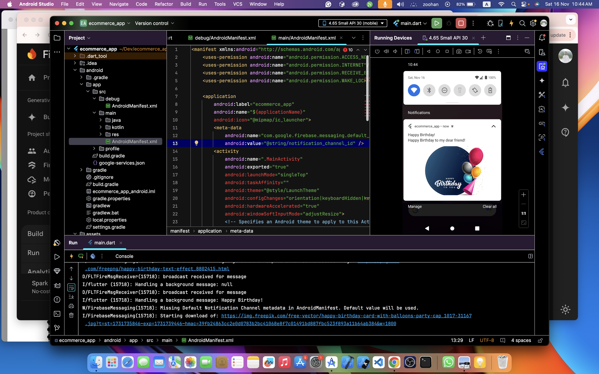

# E-commerce App

A modern Flutter e-commerce application featuring a comprehensive shopping experience with Firebase integration, offline support, and real-time notifications.

## Features

- **Product Management**
  - Product listing with search functionality
  - Detailed product views
  - Cart management system
  - Smooth checkout process

- **Authentication**
  - Firebase Authentication integration
  - Remember me functionality
  - Secure user session management

- **Data Management**
  - Integration with Fakestore API for product data
  - State management using Provider package
  - Offline support via Flutter Secure Storage
  - Cached network images for better performance

- **Real-time Features**
  - Firebase Cloud Messaging (FCM) for push notifications
  - Real-time updates for product availability
  - Notification management with app settings integration

- **User Experience**
  - Responsive and intuitive UI design
  - Loading indicators for async operations
  - Informative SnackBar messages
  - Smooth animations and transitions
  - Cross-platform compatibility (iOS & Android)

## Screenshots

### Push Notifications


## Technical Stack

- **Frontend Framework**: Flutter SDK ^3.5.3
- **State Management**: Provider ^6.1.2
- **Backend Services**:
  - Firebase Core ^3.6.0
  - Firebase Auth ^5.3.1
  - Cloud Firestore ^5.4.4
  - Firebase Messaging ^15.1.4
  - Firebase Analytics ^11.3.5

- **Data Persistence**:
  - Flutter Secure Storage ^9.2.2
  - Shared Preferences ^2.3.2
  - Hive ^2.2.3

- **Networking**:
  - HTTP ^1.2.2
  - Connectivity Plus ^6.0.5
  - Cached Network Image ^3.4.1

## Getting Started

### Prerequisites

- Flutter SDK (^3.5.3)
- Dart SDK
- Android Studio / VS Code
- Firebase project setup

### Installation

1. Clone the repository
```bash
git clone [repository-url]
cd ecommerce_app
```

2. Install dependencies
```bash
flutter pub get
```

3. Configure Firebase
   - Add your `google-services.json` for Android
   - Add your `GoogleService-Info.plist` for iOS

4. Run the app
```bash
flutter run
```

## Architecture

The app follows a clean architecture pattern with:
- Separation of concerns
- Provider for state management
- Repository pattern for data handling
- Service-based approach for external APIs

## Contributing

Contributions are welcome! Please feel free to submit a Pull Request.

## License

This project is licensed under the MIT License - see the LICENSE file for details.